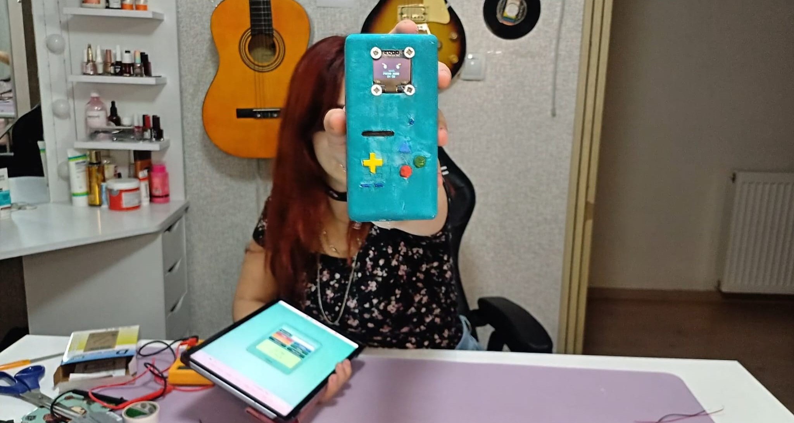
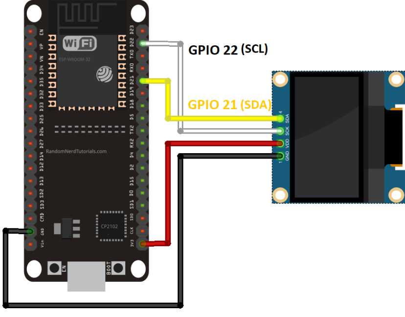

# BMO Pomodoro 🤖⏱️

🇹🇷 [Türkçe README](README_TR.md)

A handmade, web-controlled Pomodoro timer inspired by BMO and built with an **ESP32** and a **0.96-inch OLED display**.

This was the first project I shared as part of my social media project collection. It combines electronics, embedded programming, a small web interface, animated OLED expressions, and a custom 3D-designed enclosure. 💜

> The idea was simple: create a tiny desk companion that studies with me, takes breaks with me, and celebrates when I finish a focus session.



---

## Features ✨

- 25-minute focus mode
- 5-minute break mode
- Custom timer between 1 and 180 minutes
- Start, pause, resume, and reset controls
- Browser-based control panel hosted directly by the ESP32
- Live timer and connection status
- Animated BMO faces on the OLED screen
- Blinking idle animation
- Focus, break, paused, and celebration expressions
- Completed Pomodoro counter
- Automatic Wi-Fi access point if the configured network is unavailable
- Custom front and back enclosure parts designed in SolidWorks

> The completed Pomodoro count is stored only in memory and resets when the ESP32 restarts.

---

## Project Files 📁

```text
bmo-pomodoro-project/
│
├── assets/
│   └── BMO.jpeg
│
├── circuit/
│   └── bmo-connection.png
│
├── code/
│   └── bmo-pomodoro.ino
│
├── models/
│   ├── Front.SLDPRT
│   └── Back.SLDPRT
│
├── README.md
└── README_TR.md
```

| File | Description |
|---|---|
| `code/bmo-pomodoro.ino` | ESP32 firmware, OLED animations, timer logic, API, and web interface |
| `circuit/bmo-connection.png` | ESP32 and OLED wiring diagram |
| `models/Front.SLDPRT` | SolidWorks model for the front enclosure |
| `models/Back.SLDPRT` | SolidWorks model for the back enclosure |
| `assets/BMO.jpeg` | Finished project photo |

---

## Components 🛠️

- ESP32 development board
- 0.96-inch 128×64 I²C OLED display
- SSD1306-compatible OLED controller
- Jumper wires
- USB cable
- Computer with Arduino IDE or PlatformIO
- 3D-printed or handmade enclosure
- Optional paint and decorative materials

The enclosure in this project was designed as two separate SolidWorks parts: a front panel and a back cover.

---

## Circuit Connection 🔌



The OLED uses the I²C communication protocol.

| OLED Pin | Connection |
|---|---|
| `VCC` | `3.3V` |
| `GND` | `GND` |
| `SDA` | ESP32 SDA pin |
| `SCL` | ESP32 SCL pin |

### Important Pin Note

The supplied circuit diagram shows:

```cpp
#define OLED_SDA 21
#define OLED_SCL 22
```

The current Arduino sketch contains:

```cpp
#define OLED_SDA 20
#define OLED_SCL 21
```

These values must match the ESP32 model and the physical wiring you use. For a classic ESP32 DevKit wired exactly like the supplied diagram, change the sketch to:

```cpp
#define OLED_SDA 21
#define OLED_SCL 22
```

Do not connect the OLED according to one pin configuration while uploading code that uses the other.

---

## Required Libraries 📚

Install the following libraries through the Arduino IDE Library Manager:

- `Adafruit GFX Library`
- `Adafruit SSD1306`

The following libraries are included with the ESP32 Arduino core:

- `Wire`
- `WiFi`
- `WebServer`

---

## Setup and Upload 🚀

### 1. Open the Arduino sketch

Open:

```text
code/bmo-pomodoro.ino
```

### 2. Configure Wi-Fi

Find these lines and enter your own network information:

```cpp
const char* WIFI_SSID = "YOUR_WIFI_NAME";
const char* WIFI_PASSWORD = "YOUR_WIFI_PASSWORD";
```

The ESP32 first tries to connect to this network for approximately 15 seconds.

### 3. Review the fallback access point

If the configured Wi-Fi cannot be reached, BMO creates its own network:

```cpp
const char* AP_SSID = "BMO-Control";
const char* AP_PASSWORD = "bmo12345";
```

Change the default password before publicly sharing or permanently deploying the project.

### 4. Check the OLED pins

Make sure `OLED_SDA` and `OLED_SCL` match your physical connection and ESP32 board.

### 5. Select the board

In the Arduino IDE, select the ESP32 board model that matches your hardware and choose the correct serial port.

### 6. Upload the code

Compile and upload the sketch. Then open the Serial Monitor at:

```text
115200 baud
```

---

## Connecting to BMO 📱

### When BMO connects to your Wi-Fi

The OLED and Serial Monitor display the local IP address.

Open that address in a browser connected to the same network:

```text
http://BMO_IP_ADDRESS
```

For example:

```text
http://192.168.1.42
```

### When BMO cannot connect to your Wi-Fi

1. Open the Wi-Fi settings on your phone, tablet, or computer.
2. Connect to `BMO-Control`.
3. Enter the access point password.
4. Open the following address:

```text
http://192.168.4.1
```

The control panel is served directly by the ESP32, so no separate application or cloud server is required.

---

## Web Controls 🌐

The browser interface includes:

- `25 DK ODAK` — sets a 25-minute focus session
- `5 DK MOLA` — sets a 5-minute break
- `BAŞLAT` — starts the timer
- `DURAKLAT` — pauses the timer
- `DEVAM ET` — resumes a paused timer
- `SIFIRLA` — resets the current timer
- Custom duration input — accepts values from 1 to 180 minutes

The page requests the current timer status every second and updates the face, mode, remaining time, connection information, and completed session count.

---

## HTTP API 🔗

The project also provides a small HTTP API.

| Endpoint | Purpose |
|---|---|
| `GET /api/status` | Returns the current timer and network status |
| `GET /api/start` | Starts the timer |
| `GET /api/pause` | Pauses the timer |
| `GET /api/resume` | Resumes the timer |
| `GET /api/reset` | Resets the timer |
| `GET /api/preset?mode=focus` | Selects the 25-minute focus preset |
| `GET /api/preset?mode=break` | Selects the 5-minute break preset |
| `GET /api/custom?minutes=30` | Sets a custom duration |

Example status response:

```json
{
  "state": "running",
  "mode": "focus",
  "modeLabel": "FOCUS MODE",
  "time": "24:35",
  "completed": 0,
  "network": "Wi-Fi: 192.168.1.42"
}
```

---

## OLED Expressions 😊

BMO displays a different expression depending on the timer state:

| State | OLED Behaviour |
|---|---|
| Ready | Happy face with blinking animation |
| Focus | Determined focus expression |
| Break | Relaxed, sleepy expression |
| Paused | Surprised expression |
| Finished | Animated celebration face |

A completed focus session increases the Pomodoro counter. Finishing a break does not increase it.

---

## Troubleshooting 🧰

### The OLED screen is blank

- Check the `VCC` and `GND` connections.
- Verify the SDA and SCL pin definitions.
- Confirm that the OLED address is `0x3C`.
- Make sure the Adafruit libraries are installed.
- Try running an I²C scanner.
- Confirm that the display is a 128×64 SSD1306-compatible model.

### The sketch does not compile

Make sure the first line is written with `#include`:

```cpp
#include <Wire.h>
```

Also confirm that the ESP32 board package and the required Adafruit libraries are installed.

### The web page does not open

- Make sure the device and BMO are connected to the same Wi-Fi network.
- Check the IP address shown on the OLED or Serial Monitor.
- If BMO started access point mode, connect to `BMO-Control` first.
- Use `http://`, not `https://`.

### The completed counter resets

This is expected in the current version. The counter is stored in RAM and resets when the ESP32 loses power or restarts.

---

## Possible Improvements 🌱

- Physical start and reset buttons
- Buzzer or speaker notifications
- SD card sound effects
- Battery-powered operation
- Battery level indicator
- Saving the completed session count with Preferences or EEPROM
- Multiple Pomodoro profiles
- Mobile-friendly configuration page
- Over-the-air firmware updates
- Improved enclosure and button mechanisms
- More OLED expressions and animations

---

## Safety Note ⚠️

Check the voltage requirements of your ESP32 and OLED before making connections. Disconnect power while changing the wiring.

Incorrect connections or incompatible power sources may damage the components.

---

## About This Project 💜

This is a fan-made educational maker project created for learning and experimentation. It is not affiliated with or endorsed by the owners of the character that inspired it.

If you build your own version, I would loooove to see it! Feel free to open an Issue, share your improvements, or create a Pull Request.

⭐ If you enjoyed the project, you can support it by starring the repository.

**Keep building, experimenting, and making tiny desk friends!** 🤖✨
